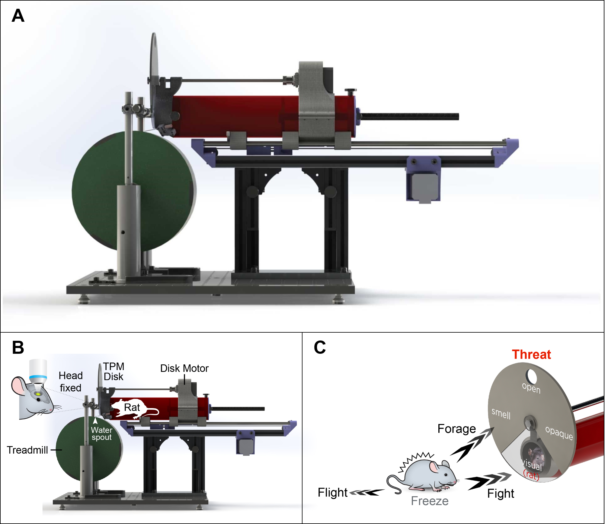
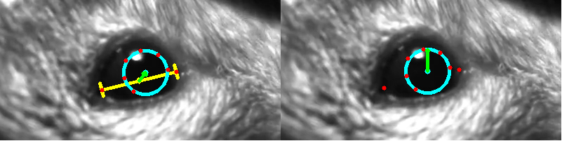
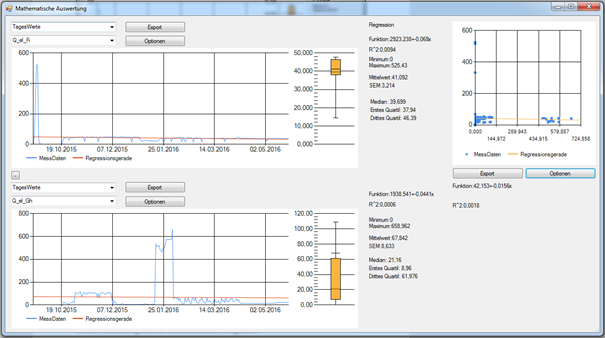
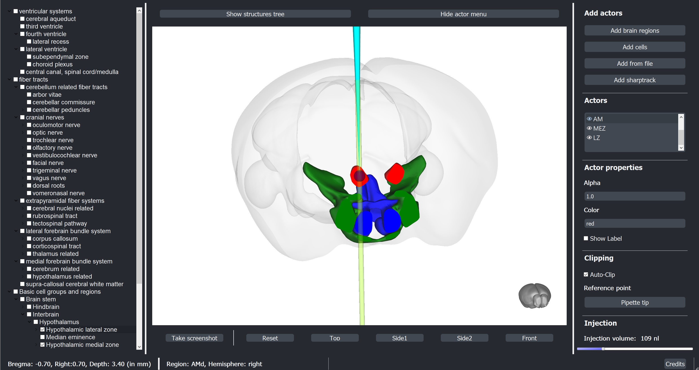
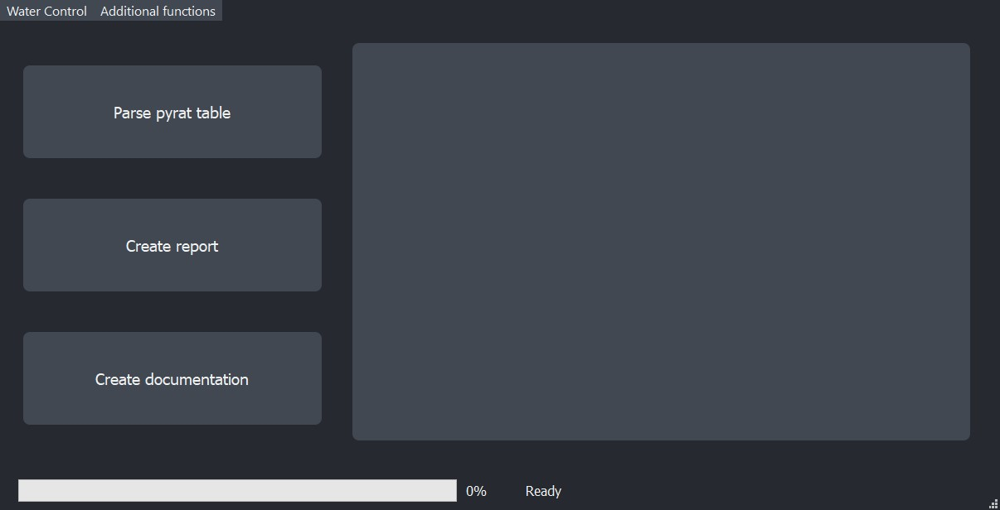

## Portfolio
---

## Active Research: Threat Perception (MATLAB, Python)
### [1. Threat Perception Setup](https://github.com/Marti-Ritter/Portfolio/tree/main/Threat%20Perception%20Setup%20(Python%20and%20Matlab))
)

---
### [2. Threat Perception Analysis](https://github.com/Marti-Ritter/Portfolio/tree/main/Threat%20Perception%20Analysis%20(Python%20and%20Matlab))
)

---

## Programming Projects 
### [1. Bachelor Thesis: Exploration of Aquaponics Data (C#)](https://github.com/Marti-Ritter/Portfolio/tree/main/Exploring%20Aquaponics%20Data%20(C%23))
)

---
### [2. Exploring Results of RNA-Sequencing (DeSeq2 in R, Python)](https://github.com/Marti-Ritter/Portfolio/tree/main/Exploring%20Changes%20in%20Gene%20Expression%20(R%20and%20Python))
)

---
### [3. Creating a Stereotactic Injection Interface (Python)](https://github.com/Marti-Ritter/Portfolio/tree/main/Injection%20Interface%20(Python))
)

---
### [4. Developing a user-friendly documentation pipeline (Python)](https://github.com/Marti-Ritter/Portfolio/tree/main/Automatic%20Documentation%20Processor%20(Python))
)

---
## Other Code Examples
- [Coursera Certificate "Applied Data Science with Python" (Python)](https://github.com/Marti-Ritter/Portfolio/tree/main/Coursera%20Applied%20Data%20Science%20(Python))
- [Bachelor Course "Basics in Programming" (Java)](https://github.com/Marti-Ritter/Portfolio/tree/main/Basics%20in%20Programming%20(Java))

---
## Documents
- [Master Thesis](https://github.com/Marti-Ritter/Portfolio/tree/main/Threat%20Perception%20Setup%20(Python%20and%20Matlab)/Master%20thesis.pdf)
- [Bachelor Thesis (German)](https://github.com/Marti-Ritter/Portfolio/tree/main/Exploring%20Aquaponics%20Data%20(C%23)/Bachelorarbeit.pdf)

---

Page template forked from <a href="https://github.com/evanca/quick-portfolio">evanca</a>

<!-- Remove above link if you don't want to attibute -->
