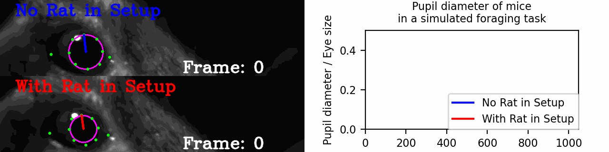

# Portfolio

#### [In case your screen does not show the full banner on the left, scroll out a bit with ctrl + mouse wheel.](## "The cut-off banner is a problem with this Jekyll theme at a small set of screen resolutions. Any lower resolutions lead to the whole page being shown in one column and thus scrollable, higher resolutions show the banner just fine. Please excuse the inconvenience!")
---

## Recent Research:
### [Social Context Restructures Behavioral Syntax in Mice](https://github.com/Marti-Ritter/social-context-restructures-behavioral-syntax-in-mice)

### [Suppression of flight and freezing responses in a simulated foraging environment containing a predator](https://github.com/Marti-Ritter/contextual-modulation-and-blunted-defensive-responses-to-predators)

---

## Data Science Projects:
### [Frame Pipeline Toolbox (Python)](https://github.com/Marti-Ritter/frame-pipeline)

### [Python ALS (Python)](https://github.com/Marti-Ritter/python-als)

### [Bachelor Thesis: Exploration of Aquaponics Data (C#)](https://github.com/Marti-Ritter/Portfolio/tree/main/Exploring%20Aquaponics%20Data%20(C%23))
)

### [Exploring Results of RNA-Sequencing (DeSeq2 in R, Python)](https://github.com/Marti-Ritter/Portfolio/tree/main/Exploring%20Changes%20in%20Gene%20Expression%20(R%20and%20Python))
)

---

## Team-focused Projects:
### [Developing a user-friendly documentation pipeline (Python)](https://github.com/Marti-Ritter/Portfolio/tree/main/Automatic%20Documentation%20Processor%20(Python))
)

### [User Input Tools (Python)](https://github.com/Marti-Ritter/behavioral-analysis/tree/main/user_input)

---

## Hardware-focused Projects:
### [Threat Perception Setup](https://github.com/Marti-Ritter/Portfolio/tree/main/Threat%20Perception%20Setup%20(Python%20and%20Matlab))
)

### [Creating a Stereotactic Injection Interface (Python)](https://github.com/Marti-Ritter/Portfolio/tree/main/Injection%20Interface%20(Python))
)
---

## Other Code Examples
- [Coursera Certificate "Applied Data Science with Python" (Python)](https://github.com/Marti-Ritter/Portfolio/tree/main/Coursera%20Applied%20Data%20Science%20(Python))
- [Bachelor Course "Basics in Programming" (Java)](https://github.com/Marti-Ritter/Portfolio/tree/main/Basics%20in%20Programming%20(Java))

---

## Documents
- [Social Context Restructures Behavioral Syntax in Mice (Preprint)](https://www.biorxiv.org/content/10.1101/2025.04.17.648924v2)
- [Master Thesis](https://github.com/Marti-Ritter/Portfolio/tree/main/Threat%20Perception%20Setup%20(Python%20and%20Matlab)/Master%20thesis.pdf)
- [Bachelor Thesis (German)](https://github.com/Marti-Ritter/Portfolio/tree/main/Exploring%20Aquaponics%20Data%20(C%23)/Bachelorarbeit.pdf)

---

Page template forked from <a href="https://github.com/evanca/quick-portfolio">evanca</a>

<!-- Remove above link if you don't want to attibute -->
